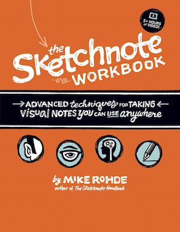

[](https://gitpitch.com/enogrob/ebook-project/master)
```
Roberto Nogueira  
BSd EE, MSd CE
Solution Integrator Experienced - Certified by Ericsson
```
# eBook Sketchnote Workbook



**About**

Learn everything you need to about the subject of this `eBook` project.

[Homepage](http://www.peachpit.com/store/sketchnote-workbook-advanced-techniques-for-taking-9780133831719)

## Topics
```
[ ] 1. SKETCHNOTING QUICKSTART OVERVIEW
[ ] 2. SKETCHNOTE IDEA GENERATION
[ ] 3. SKETCHNOTE IDEA MAPPING
[ ] 4. SKETCHNOTE PLANNING
[ ] 5. SKETCHNOTE DOCUMENTATION
[ ] 6. SKETCHNOTING TRAVEL EXPERIENCES
[ ] 7. SKETCHNOTING FOOD EXPERIENCES
[ ] 8. SKETCHNOTING MOVIES, TV, & MEDIA
[ ] 9. ADVANCED SKETCHNOTING TIPS & TECHNIQUES
```
